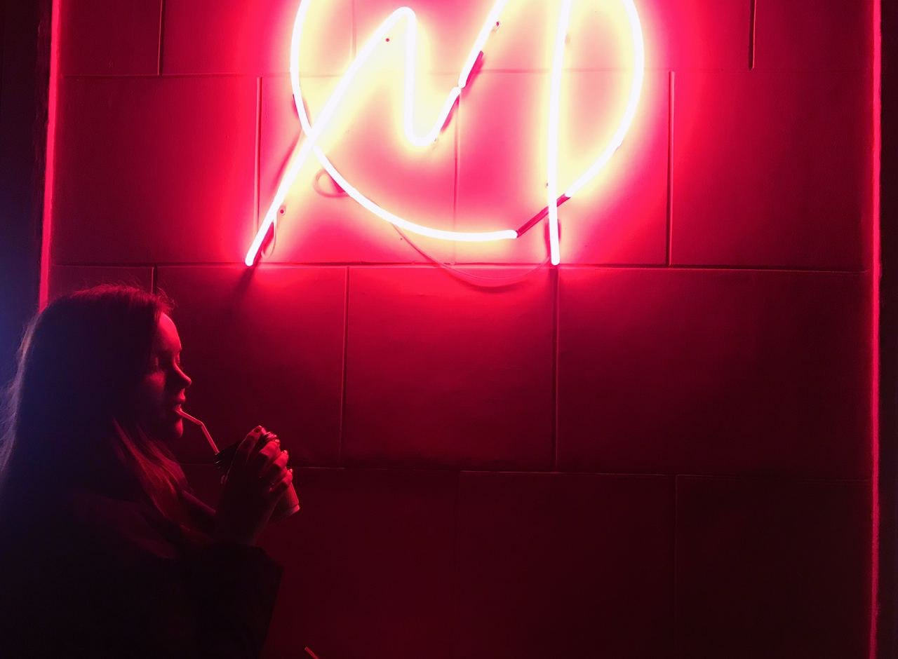

# _Novikova Volha_  


- - -

### _My Contact Info:_

- **Address**: Turkey, Alanya
- **Phone**: +90 (531) 328-86-34
- **E-mail**: volha.novikova.01@gmail.com
- **GitHub**: [@olya.novikova](https://github.com/OlyaNovikova)
- **CodePen**: [@Novikova1](https://codepen.io/Novikova1)

- - -

### _About me:_

Previously, I studied layout on my own, realized that I wanted to do web development, decided to take Skillbox courses and take rs.school courses in parallel. I devote all my free time to learning, and in my free time I like to go to the sea and drink beer)

- - -

### _Skills:_

- *HTML*
- *CSS* (BEM methodology)
- *Version control*: Git
- *Figma* (for web development)
- *Editors*: (Sublime, VSCode)

- - -

### _Code example:_

```javascript
function multiply(a, b){
  return a * b
}
```

- - -

### _Education:_

- *Сourse*: "Web developer from scratch to PRO" from Skillbox

- - -

### _Languages:_

- *Russian*
- *English A2*

- - -